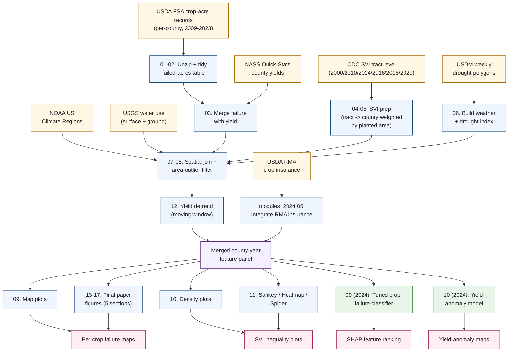

# crop-failure-svi

**Where US crops fail, and who lives in the counties that bear it — a
multi-source pipeline tying USDA crop-failure records to climate hazards,
groundwater, and the CDC Social Vulnerability Index, with interpretable
machine-learning attribution.**

This repository documents an end-to-end study of **county-level crop
failure across the contiguous United States** from 2009 to 2023.
The work joins:

- 15 years of **USDA Farm Service Agency** per-county **failed-acres and
  prevented-planting records**;
- **NASS Quick-Stats** annual county yields, detrended;
- **CDC Social Vulnerability Index** (SVI) at census-tract level, weighted
  up to counties by the per-crop planted area;
- The **US Drought Monitor** (USDM) annual drought-area aggregates;
- A **county-level heatwave-frequency index**;
- USGS surface- and **ground-water** withdrawal rates;
- USDA **Risk Management Agency crop-insurance** loss-cause data; and
- NOAA **US Climate Regions** as a stratifying covariate.

The pipeline produces (i) **per-crop national maps** of crop failure and
yield negative-anomaly hotspots, (ii) **multi-axis cross-cuts** between
crop type, irrigation regime, and social vulnerability tier, (iii) **density
plots** that quantify how failure burden tracks SVI percentile, and (iv) an
**interpretable machine-learning classifier** trained on the merged
county-year panel with SHAP attribution per feature.

---

## Headline Findings

### Crop failure does not fall on US counties evenly


Mean **failure share** (failed acres ÷ planted acres) per county, 2009-2023.
Concentrations in the Northern Plains belt, the Mississippi Delta, and
pockets of Texas dominate.

### Per-crop yield negative anomalies highlight different geographies

| | | |
|:---:|:---:|:---:|
|  |  |  |
| **CORN** | **SOYBEANS** | **WHEAT** |

Fraction of years 2009-2023 with a county-level negative yield anomaly. Each
crop has a different stress footprint — corn concentrates in the rain-fed
Eastern Corn Belt edges + the Plains, soybeans in the Mississippi corridor
and Eastern Plains, wheat in the Great Plains, Pacific Northwest, and the
Texas Panhandle.

### The climate hazards driving failure are themselves spatially uneven

| | |
|:---:|:---:|
|  |  |
| **Drought** annual frequency | **Heatwave** annual frequency |

USDM-derived annual drought frequency (left) is concentrated in the
Southwest; heatwave frequency (right) covers a broader Southern band but
intensifies in the Plains. Comparison with the failure maps above
quantifies how much of each crop's stress geography is explained by
climate.

### Social vulnerability is the third axis


CDC SVI overall percentile (theme composite) per county. High-vulnerability
counties cluster across the Deep South, the Texas/Mexico borderlands, and
Appalachia.

### Crop type → irrigation regime → vulnerability tier


Sankey flow from **crop type → irrigation regime → SVI vulnerability tier**.
Wheat-dominated rain-fed acreage flows disproportionately into the
medium-to-high SVI tiers; irrigated cotton and corn split more evenly.
This is the chart that captures the project in one image.

### Failure burden tracks SVI — the headline distributional finding


For every crop, the orange "high failure share" density is **shifted
toward the higher-SVI end of the distribution** compared with the green
"low failure share" density. That is: the counties bearing the most
acres-failed-per-acre-planted skew toward higher social vulnerability.
The story is consistent across rain-fed and irrigated regimes and across
all 8 commodity crops in the study.

### A trained classifier puts numbers on the drivers


SHAP-summary plot for the **CORN** failure classifier (one of eight
crop-specific models). The bars rank features by mean absolute SHAP
contribution; the colour gradient shows whether a feature pushes the
prediction toward "failure" (red) or "no failure" (blue) at a given value.

---

## Pipeline



---

## Repository Structure

```
.
├── README.md                                    # this file
├── docs/
│   ├── methodology.md                           # end-to-end method writeup
│   ├── data_sources.md                          # every input dataset with link + licence
│   └── figures/                                 # 10 publication-quality PNGs (~6 MB)
├── notebooks/
│   ├── README.md                                # notebook map (full pipeline)
│   ├── phase1_2023/                             # 17 notebooks — exploratory pass
│   │   ├── 01_crop_failure_data_preparation.ipynb
│   │   ├── 02_crop_yield_failure_preprocess.ipynb
│   │   ├── ...
│   │   └── 17_final_plots_section_5_-_ground_water.ipynb
│   └── phase2_2024/                             # 11 notebooks — refined pass
│       ├── 01_crop_area_weighted_svi_for_counties.ipynb
│       ├── ...
│       ├── 09_crop_failure_machine_learning_final_-_tuning.ipynb
│       ├── 10_crop_failure_yield_machine_learning_final.ipynb
│       └── 11_yield_movwinave_anomaly_machine_learning.ipynb
└── data/
    ├── state_name_mapping.csv                   # FSA state-name lookup (USDA legacy)
    └── fsa_acre_data_sources.md                 # canonical USDA FSA URLs, 2009-2023
```

The **full 28-notebook pipeline** is included (Phase 1 — 17 exploratory
notebooks for data ingest, indices, and per-section figures; Phase 2 — 11
refined notebooks for the per-crop SVI weighting, RMA insurance
integration, and the machine-learning models). Every notebook has been
sanitised for public release — Drive mount cells dropped, data paths
rewritten to `<DATA_ROOT>/`, author metadata redacted. See
[`notebooks/README.md`](notebooks/README.md) for the full per-notebook
map and the recommended execution order.

---

## Methodology in one paragraph

The project starts from the USDA FSA's per-county, per-crop **failed-acres**
and **prevented-planting** records, which we harmonise into a tidy panel
keyed by `(year, state-county-FIPS, crop, irrigation_regime)`. We join in
NASS Quick-Stats county yields, the CDC SVI at census-tract level
**weighted to county scale by per-crop planted area**, an annual drought-
and heatwave-frequency index per county derived from USDM, USGS surface-
and groundwater-withdrawal rates, USDA RMA crop-insurance loss-cause
codes, and the NOAA US Climate Regions as a stratifier. The resulting
county-year feature panel feeds two interpretable ML models: a
**hyperparameter-tuned classifier** that predicts the binary occurrence of
crop failure, and a **moving-window yield-anomaly regressor** that
predicts a continuous detrended yield-deviation. SHAP-value attribution
exposes the relative contribution of climate, water-resource, and
social-vulnerability features.

See [`docs/methodology.md`](docs/methodology.md) for the full description.

---

## Data Sources

Every input dataset, with download URLs and licence notes, is enumerated
in [`docs/data_sources.md`](docs/data_sources.md). All sources are public,
US-federal-government or CDC, and free to use.

For the **USDA FSA crop-acre eFOIA files** specifically, the canonical
2009–2023 URLs are kept in
[`data/fsa_acre_data_sources.md`](data/fsa_acre_data_sources.md) so the
download step in the pipeline can be reproduced byte-for-byte.

---

## Reproducibility

The notebooks are written to be **runnable on any Jupyter / Colab kernel**
with the standard scientific-python stack
(`pandas`, `geopandas`, `numpy`, `scikit-learn`, `xgboost`, `shap`,
`matplotlib`, `seaborn`, `plotly`). They reference an external
`<DATA_ROOT>/` placeholder that should point at a working directory holding
the input data and intermediate parquet files. Setting up `<DATA_ROOT>`
amounts to:

1. Mirror the directory structure in `docs/data_sources.md`.
2. Download the FSA acre ZIPs listed in `data/fsa_acre_data_sources.md`.
3. Pull the SVI shapefiles from `https://svi.cdc.gov/Documents/Data/`
   for years 2000, 2010, 2014, 2016, 2018, 2020.
4. Pull NASS county yields with the Quick-Stats API.

The two shipped ML notebooks are self-contained relative to that root.

---

## Citations and Acknowledgements

- **USDA Farm Service Agency** — crop-acre eFOIA data (2009-2023, public domain).
- **USDA NASS Quick-Stats** — county yield series.
- **CDC / ATSDR** — Social Vulnerability Index (SVI), 2000–2020.
- **NOAA National Centers for Environmental Information** — climate regions, heatwave records.
- **National Drought Mitigation Center** — US Drought Monitor.
- **USGS** — county-level water-use estimates.
- **USDA Risk Management Agency** — crop-insurance loss-cause records.

---

## License

Code: MIT (unless otherwise noted in individual files).
Data: see the licence notes per source in `docs/data_sources.md`.
Documentation and figures: CC-BY 4.0.
